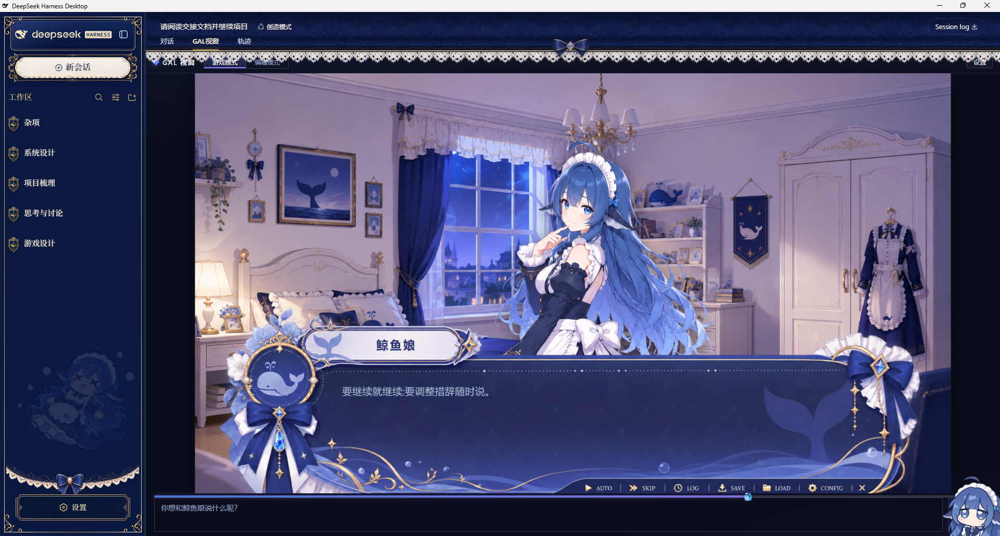
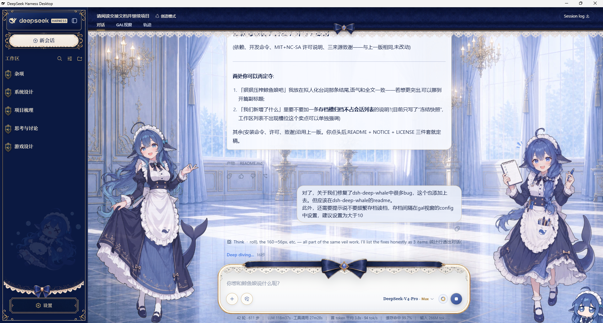
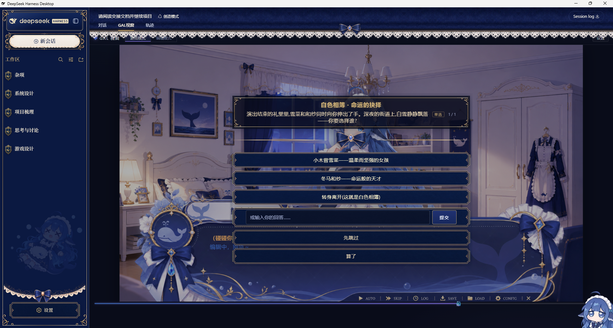
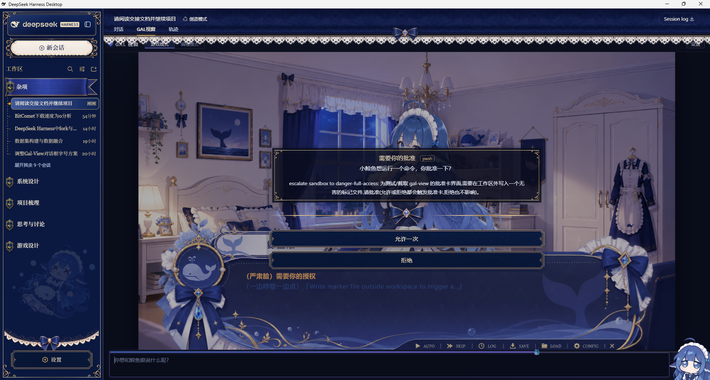
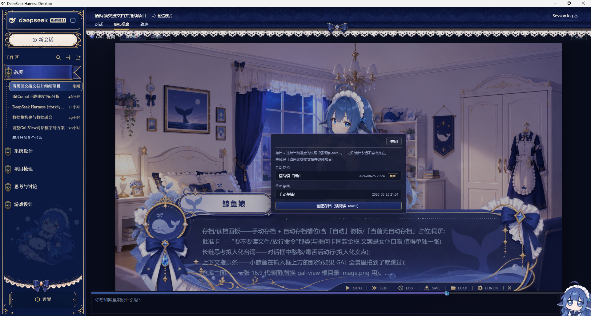
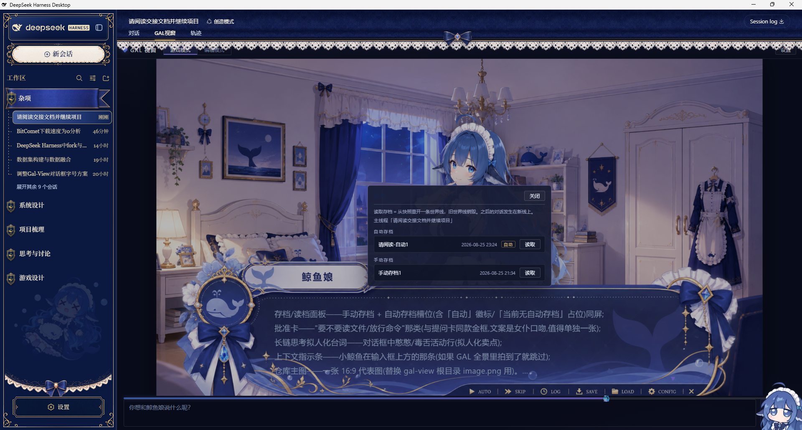
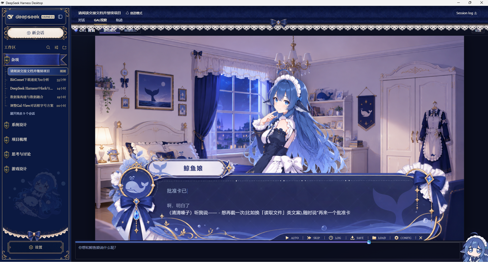
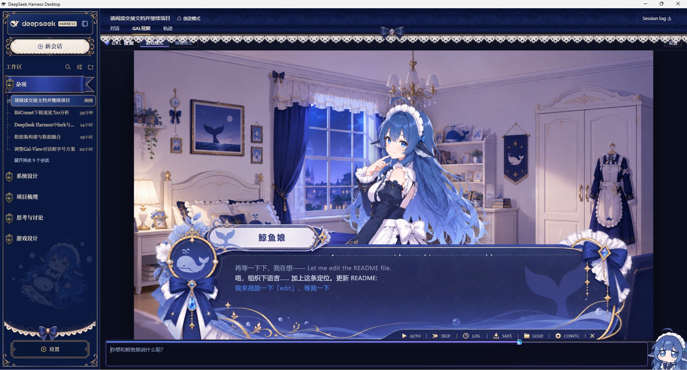
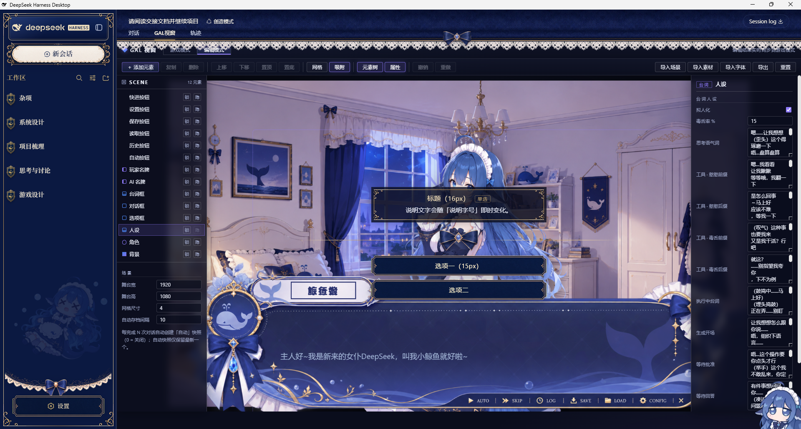

# GAL 视窗(gal-view · 鲸鱼娘改造版)

谁不想和憨憨的鲸鱼娘来一场旮旯 game 呢?

> 项目基于 [Ayase34/gal-view](https://github.com/Ayase34/gal-view)(© Yunicon, MIT)。
> 本仓库在其基础上进行了大量改造与增强,详情见下文「我们新增了什么」。

把 DSH Web 的会话页变成 **Galgame 风格的视觉小说视窗**:对话以台词打字机逐字呈现,
背景、立绘、对话框全部可视化编辑。

最关键的——**没有选项,怎么叫 galgame?**

## 我们新增了什么

- **工作陪伴两不误**:这个视窗不只是"玩"——**日常正常工作里也能用**:长链思考、
  读写文件、执行命令时,鲸鱼娘都在一旁念叨陪伴、帮你盯着进度,干活不孤单;
  拟人化只是展示层,**绝不干扰模型正常工作与任务结果**;
- **全量 galgame 化选择框**:DSH 里所有的提问、批准(要不要读文件?要不要写文件?
  要不要放行这条命令?)——选择框全部变成「金线标题框 + 蝴蝶结分隔 + 大选项框」的
  galgame 风格,在视窗内直接点选作答,再也不用跳回「对话」栏;
- **拟人化台词**:长链思考、工具调用不再是冷冰冰的「编写代码中」——鲸鱼娘会念叨
  憨憨的、偶尔毒舌的台词(默认 216 条词池;毒舌率、全部词池都能在编辑模式里自定义)。
  狠狠压榨鲸鱼娘吧;
- **快照式存档 / 读档**:像真正的 galgame 一样 SAVE / LOAD——存档把当前进度冻结成
  快照,读多少次都不会变;读档从快照重开一条世界线并销毁旧世界线;主线程每 N 轮对话
  自动存档(带「自动」标识,永不覆盖,间隔可配置);
- **编辑模式增强**:舞台元素拖拽 / 缩放 / 旋转;「人设」(词池、毒舌率)与「选项框」
  (标题 / 选项 / 说明字号)设置条目,字号调整在画布中央**实时预览**;
- **视觉体验**:游戏模式背景 cover 铺满整个窗口、上下文占用指示条(小鲸鱼随上下文
  增长从左游到右)、输入框占位语会喊出你的 AI 名牌(「你想和「xx」说什么呢?」);
- **细节打磨**:决策面板出现 / 消失不闪屏不缩放、skip 一键直达当前对话末尾、
  自动播放带转圈提示、相邻人设台词不再连续重复……

## 原项目已有(保留)

- Galgame 风格对话视图:16:9 舞台、台词打字机、点击翻页、自动播放、历史 / 设置;
- 场景元素可视化编辑器(舞台 / 角色 / 对话框 / 名牌 / 功能按钮等)。

## 一键安装(完整体验三连)

```bash
dsh plugin --profile web add github:RichardMLe/gal-view#main
dsh plugin --profile web add github:RichardMLe/dsh-deep-whale#main
dsh plugin --profile web add github:MeteorNOX/DeepSeek-Balance-Whale-Widget
```

安装后重启 web 服务,会话页顶部会出现「GAL 视窗」标签页。

## 依赖与兼容

- 需要 DSH Web(支持 `sessions.fork` 会话分叉与 `workspaces.archiveSession`);
- 存档 / 读档依赖宿主会话分叉能力,不支持的环境会自动降级(按钮禁用 + 提示);
- 决策面板所需的皮肤资产(蝴蝶结 / 金框 / 转角花纹)已内联进本包,无需额外安装皮肤;
- 完整视觉体验建议搭配上方三连中的女仆皮肤与鲸鱼组件。

## 注意事项

- **请勿频繁存档 / 读档**:每次存档都会冻结一个快照会话、每次读档都会重开一条世界线
  并销毁旧线——存档会随使用次数累积,请按需使用;
- **自动存档间隔**在 GAL 视窗右上角「设置」中配置,**建议设置为大于 10**(默认 10):
  间隔过小会产生过多自动存档。

## 界面预览

| 界面 | 截图 |
|---|---|
| GAL 视窗(游戏模式) |  |
| 对话界面(输入框/统计行) |  |
| galgame 式选择框 |  |
| 批准卡 |  |
| 存档面板 |  |
| 读档面板 |  |
| 拟人化台词(1/2/3) |    |
| 上下文指示条 |  |
| 编辑模式 |  |

> 截图文件存放在仓库 `docs/screenshots/` 目录;fork 后可按需替换。

## 常见问题

**拟人化台词会影响模型正常工作吗?**

不会。所有憨憨 / 毒舌台词都是**纯前端展示层**:GAL 视窗只是根据模型已有的思考内容、
工具调用信息,即时生成一句人设文案显示在对话框里。它**不写入会话记录、不回传给模型、
不修改任何提示词与输出**——模型该干什么干什么,运行结果与不开拟人化时完全一致,
不存在"污染模型运行结果"的问题,可放心使用。

## 开发

```bash
npm run test            # 单测(node --test 直接执行)
npm run build:client    # 重新生成 .dsh-plugin/client.js(esbuild)
npm run check:client    # 校验产物与源码一致
node verify-bundle.mjs  # 仿真验证(官方 __ModuleLoader__ 契约 + 存档端到端)
```

## 许可

- 代码与原项目一致:**MIT** © 2026 Yunicon(见 LICENSE);
- 内置皮肤资产(蝴蝶结 / 设置金框 / 转角花纹)来自
  [Small-tailqwq/dsh-deep-whale](https://github.com/Small-tailqwq/dsh-deep-whale),
  依 **CC-BY-NC-SA-4.0** 授权(署名—非商业性使用—相同方式共享);
- 场景中的角色立绘 / 背景 / 对话框素材为 **AI 生成**,本项目专用;
- 完整署名见 [NOTICE](NOTICE.md)。整体发行包含上述 NC-SA 资产,**请勿用于商业用途**。

## 致谢

- [Yunicon / Ayase34](https://github.com/Ayase34/gal-view) — gal-view 原作(MIT)
- [Small-tailqwq](https://github.com/Small-tailqwq/dsh-deep-whale) — 女仆皮肤与皮肤资产(CC-BY-NC-SA-4.0)
- [MeteorNOX](https://github.com/MeteorNOX/DeepSeek-Balance-Whale-Widget) — 鲸鱼组件(MIT)
